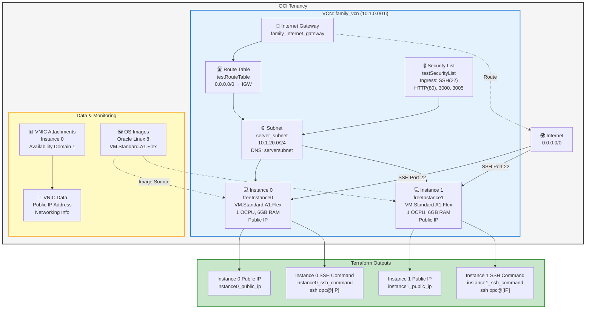

# OCI Minecraft Infrastructure Diagram

## Architecture Overview



## Key Components

### Network
- **VCN**: family_vcn (10.1.0.0/16)
- **Subnet**: server_subnet (10.1.20.0/24)
- **Internet Gateway**: family_internet_gateway
- **Route Table**: Routes all traffic (0.0.0.0/0) to IGW
- **Security List**: Allows SSH (22), HTTP (80), and ports 3000, 3005

### Compute Instances
- **Instance 0**: freeInstance0 - VM.Standard.A1.Flex (1 OCPU, 6GB RAM)
- **Instance 1**: freeInstance1 - VM.Standard.A1.Flex (1 OCPU, 6GB RAM)
- Both instances have public IPs for direct SSH access
- OS: Oracle Linux 8

### Access Methods
- Direct SSH access to each instance using public IPs
- SSH commands available in Terraform outputs
    style Monitoring fill:#e8f5e9,stroke:#388e3c,stroke-width:2px
    style Outputs fill:#fff8e1,stroke:#fbc02d,stroke-width:2px
    style Internet fill:#ffebee,stroke:#d32f2f,stroke-width:2px
    style Instance0 fill:#c8e6c9,stroke:#388e3c,stroke-width:2px
    style Instance1 fill:#c8e6c9,stroke:#388e3c,stroke-width:2px
    style LoadBalancer fill:#fff9c4,stroke:#f9a825,stroke-width:2px
    style HTTPListener fill:#ffe0b2,stroke:#ff6f00,stroke-width:2px
    style HTTPSListener fill:#ffe0b2,stroke:#ff6f00,stroke-width:2px
```

## Key Components

### Network Infrastructure
- **2 VCNs**: test_vcn (primary) and vcn-family (secondary)
- **3 Subnets**: test_subnet, subnet-public, subnet-private
- **Internet Gateways**: Provide internet connectivity for both VCNs
- **Route Tables**: Direct all outbound traffic through IGWs
- **Security Lists**: Control inbound/outbound traffic (SSH, HTTP, custom ports)

### Compute Layer
- **2 EC2 Instances**: freeInstance0 and freeInstance1
  - Shape: VM.Standard.A1.Flex (ARM, always-free tier)
  - 1 OCPU, 6GB RAM each
  - Public IP addresses assigned
  - SSH public key authentication configured

### Load Balancing & Traffic Management
- **Flexible Load Balancer**: 10 Mbps bandwidth
  - **Backend Set**: Round-robin load balancing policy
  - **Health Checks**: HTTP GET on port 80, path "/"
  - **Session Persistence**: Cookie-based (lb-session1)
  
- **HTTP Listener** (Port 80)
  - Hostname: app.free.com
  - Rule set adds custom headers
  - Methods: GET, POST only
  
- **HTTPS Listener** (Port 443)
  - Same hostname and backend set
  - SSL/TLS encryption with self-signed certificate
  - No peer certificate verification

### Security & TLS
- **TLS Private Key**: ECDSA with P384 curve
- **Self-Signed Certificate**: 
  - Organization: Oracle
  - Country: US
  - State: TX
  - Locality: Austin
  - Validity: 1 year
  - Used for HTTPS listener

### Data Sources & Monitoring
- **OS Images**: Oracle Linux 8, filtered for VM.Standard.A1.Flex
- **VNIC Attachments**: Queries Instance 0's network interface
- **VNIC Data**: Extracts public IP and network information

### Outputs
- `lb_public_ip`: Load balancer's public IP address
- `app`: HTTP URL to the application (Instance 0's public IP)

## Traffic Flow

1. **Internet → HTTP (Port 80)**
   - Request → Load Balancer Port 80
   - Load Balancer rules check method (GET/POST only)
   - Round-robin to Instance 0 or Instance 1 on port 80

2. **Internet → HTTPS (Port 443)**
   - Request → Load Balancer Port 443
   - TLS handshake with self-signed certificate
   - Decrypted traffic routed to backend on port 80
   - Round-robin to Instance 0 or Instance 1

## High Availability Configuration
- Load balancer distributes traffic across 2 instances
- Health checks monitor instance availability (port 80)
- If one instance fails, traffic routes exclusively to the healthy instance
- Both instances have public IPs for direct SSH access if needed

## Notes
- Uncommented: Autonomous Database resources are currently commented out
- The infrastructure supports Minecraft servers or any HTTP-based application
- Custom ports 3000 and 3005 are open for application-specific services
- Port 25655 is available on vcn-family security list (Minecraft default port)
