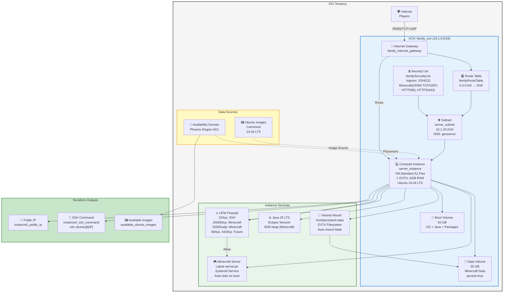

# OCI Minecraft Infrastructure Diagram

## Architecture Overview



## Key Components

### Network Layer
- **VCN**: family_vcn (10.1.0.0/16) - Virtual Cloud Network
- **Subnet**: server_subnet (10.1.20.0/24) - Private subnet for instance
- **Internet Gateway**: family_internet_gateway - Routes traffic to/from internet
- **Route Table**: familyRouteTable - Routes 0.0.0.0/0 to IGW
- **Security List**: familySecurityList - Network-level firewall rules

### Compute Instance
- **Name**: server_instance
- **Type**: VM.Standard.A1.Flex (ARM64-based, always-free tier)
- **Resources**: 1 OCPU, 6GB RAM
- **OS**: Canonical Ubuntu 24.04 LTS
- **Public IP**: Elastic IP for SSH and Minecraft access
- **SSH User**: `ubuntu` (created by cloud-init)
- **SSH Keys**: Injected via terraform variable

### Storage Volumes

#### Boot Volume
- **Size**: 50 GB SSD
- **Mount**: `/` (root filesystem)
- **Purpose**: OS, system packages, Java runtime
- **Lifecycle**: Destroyed with instance

#### Data Volume (Persistent)
- **Size**: 50 GB SSD
- **Mount**: `/mnt/persistent-data` 
- **Filesystem**: EXT4
- **Mount Options**: Auto-mount via `/etc/fstab`
- **Lifecycle**: `prevent_destroy = true` - **Survives instance rebuilds**
- **Contents**:
  - `/mnt/persistent-data/minecraft/server/world/` - Minecraft world data
  - `/mnt/persistent-data/minecraft/server/server.jar` - Minecraft server executable
  - `/mnt/persistent-data/minecraft/server/server.properties` - Server config
  - `/mnt/persistent-data/minecraft/server/eula.txt` - EULA acceptance
  - `/mnt/persistent-data/minecraft/server/logs/` - Server logs

### Host-Level Firewall (UFW)
- **Manager**: UFW (Uncomplicated Firewall) is sole firewall manager
- **Conflict Prevention**: iptables-persistent removed, existing iptables rules cleared at startup
- **Default Policy**: Deny all incoming, Allow all outgoing
- **Open Ports**:
  - 22/tcp - SSH access
  - 25565/tcp - Minecraft Java Edition
  - 25565/udp - Minecraft Query protocol
  - 80/tcp - HTTP (for future use)
  - 443/tcp - HTTPS (for future use)

### Automated Services (via user_data.sh)

#### Volume Setup
- Detects and mounts data volume on first boot
- Formats with EXT4 if new (first-time setup)
- Skips formatting if already formatted (data preservation)
- Adds to fstab for persistent mounting

#### Java Installation
- **Runtime**: Eclipse Temurin Java 25 LTS
- **Method**: Downloaded directly from GitHub releases (supports ARM64)
- **Installation**: `/opt/jdk-25.0.1+8/`
- **Links**: `/usr/bin/java` and `/usr/bin/javac`
- **Heap**: 4-6 GB configured for Minecraft server

#### Minecraft Server
- **Distribution**: Latest server.jar from launcher API
- **Location**: `/mnt/persistent-data/minecraft/server/`
- **Service**: systemd service for auto-start and restart-on-failure
- **EULA**: Automatically accepted on first boot
- **Features**: Version checking, auto-updates, automatic service start

#### User Management
- **System User**: `minecraft` (UID 1003, fixed for persistence)
- **SSH User**: `ubuntu` (standard Canonical user)
- **Sudo User**: `your_admin_user` (with NOPASSWD for convenience)

### Terraform File Organization
- **main.tf** - Outputs and terraform data sources for image discovery
- **network.tf** - VCN, subnets, gateways, route tables, security lists
- **compute.tf** - Instance, volumes, attachments, lifecycle rules
- **variables.tf** - All input variable definitions
- **provider.tf** - OCI provider configuration
- **variables.tf** - Variable definitions
- **terraform.tfvars** - User-supplied variable values (secrets - don't commit)

## Ports & Services

### OCI Security List Rules (Network Layer)
| Port | Protocol | Purpose | Source |
|------|----------|---------|--------|
| 22 | TCP | SSH (admin access) | 0.0.0.0/0 |
| 25565 | TCP | Minecraft Java Edition | 0.0.0.0/0 |
| 25565 | UDP | Minecraft Query protocol | 0.0.0.0/0 |
| 80 | TCP | HTTP (future use) | 0.0.0.0/0 |
| 443 | TCP | HTTPS (future use) | 0.0.0.0/0 |
| All | All | Egress (outbound) | 0.0.0.0/0 |

### UFW Firewall Rules (Host Layer)
Provides defense-in-depth at the instance level:
- **SSH**: 22/tcp - Allow
- **Minecraft**: 25565/tcp+udp - Allow
- **HTTP/HTTPS**: 80/tcp, 443/tcp - Allow
- **Default**: Deny all incoming, Allow all outgoing

## Firewall Architecture (Two-Layer Defense)

**Layer 1: OCI Security List** (Network Level)
- Protects at VCN boundary
- Region-wide consistency
- Prevents unwanted traffic before reaching instance

**Layer 2: UFW Firewall** (Host Level)
- Protects at instance level
- Process-aware filtering
- Survives instance rebuilds
- Quick iteration without Terraform

**Why Both?**
- Network-level firewall: Broad protection, region-level policy
- Host-level firewall: Fine-grained control, process isolation
- Redundancy: If one misconfigured, other protects
- Standards compliance: Defense-in-depth principle

## Key Features & Notes

### Always-Free Tier
- VM.Standard.A1.Flex: 1 OCPU, 6GB RAM - **$0/month**
- Up to 200GB block storage included - **$0/month**
- 10GB monthly egress - **$0/month** if stayed within limit
- **Total: $0/month** for small servers

### Data Persistence
- **Data volume has `prevent_destroy = true`**
- When instance is destroyed and recreated:
  - Old instance is removed
  - Data volume remains in OCI storage
  - New instance automatically reattaches volume
  - All Minecraft data (worlds, server.jar) immediately available
- Manual backup recommended for critical worlds

### Automated Initialization
- **user_data.sh** runs once on first instance boot
- Handles: Volume setup, Java installation, Minecraft download, firewall config
- Takes ~5-10 minutes to complete
- Logs available: `/var/log/minecraft-volume-setup.log`

### Minecraft Server Details
- **Automatic startup**: systemd service with restart-on-failure
- **Auto-updates**: Checks and downloads latest server.jar on boot
- **Version tracking**: Backs up old versions before updating
- **Configuration**: `/mnt/persistent-data/minecraft/server/server.properties`

### Security Features
- **Dual firewall**: Network (OCI) + Host (UFW) layers
- **SSH keys only**: No password authentication
- **Always-on updates**: Ubuntu 24.04 LTS receives security patches
- **No public database ports**: Only SSH and Minecraft exposed
- **Isolated users**: Minecraft runs as dedicated system user

### Scaling Options
- **Stay free**: Keep 1 OCPU A1, manage player count
- **Affordable upgrade**: 2-4 OCPU A1 (~$40-80/month)
- **Multi-instance**: Load balancer + multiple servers (requires changes)

### Linux Users & SSH
- **System Users**:
  - `ubuntu` - Default SSH user (created by cloud-init)
  - `minecraft` - Dedicated service user (UID 1003, fixed)
  - `your_admin_user` - Optional sudo user (created in user_data.sh)
  
- **SSH Access**: `ssh ubuntu@<public-ip>`
- **Keys**: Managed via terraform variable `ssh_public_key_path`

### Development Workflow
```
Local Changes:
  terraform plan    → Review what will change
  terraform apply   → Deploy changes
  
Destroy & Rebuild:
  terraform taint oci_core_instance.server_instance
  terraform apply   → Instance recreates, data volume reattaches
  
Full Teardown:
  terraform destroy → All resources destroyed
  Note: Data volume persists (can manually delete)
```
